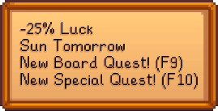
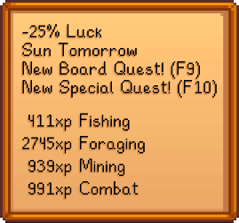
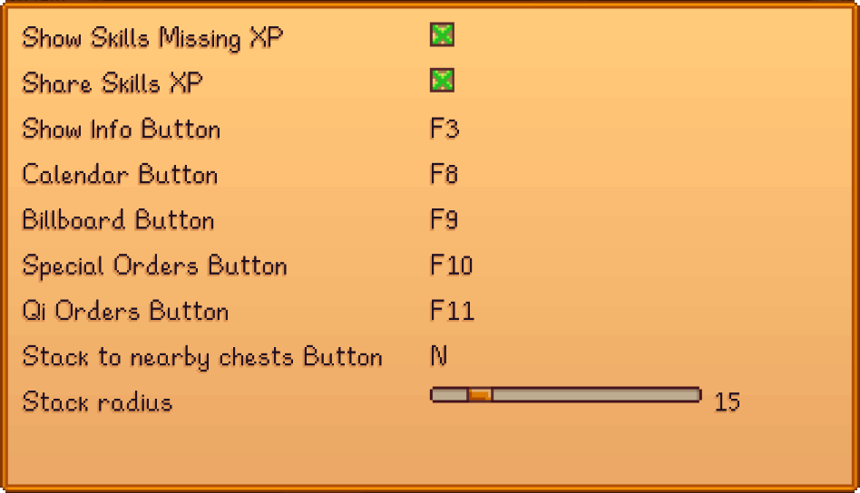

# SV-DisplayLuck
This is my custom mod. It was created in order to display the player luck instead of looking at the TV every day. Then I started adding more and more stuff. 😝

---

The mod displays a little box at the top left corner which displays the following information.
_You can configure the menu to show the missing XP until the next skill level_

 

The mod also allows the player to stack to nearby chests (N key by default)

---

These are the available mod configurations

I can't make sure it works at 100% so use it at your own risk.

The mod required SMAPI in order to work.
You can compile the solution yourself or just use the already [compiled dll](Mod/DisplayLuck.dll)